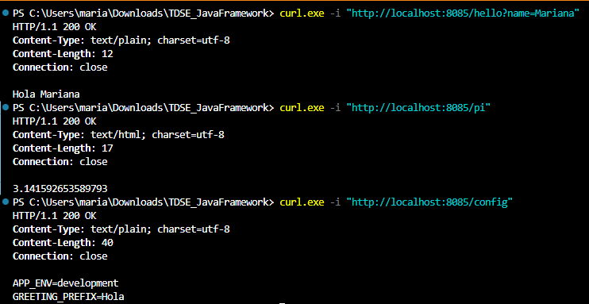
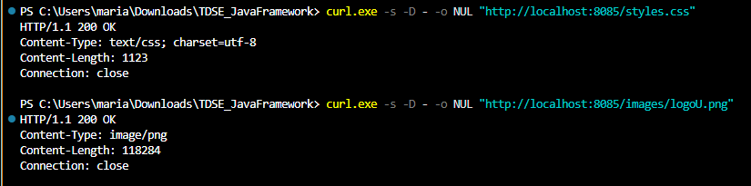
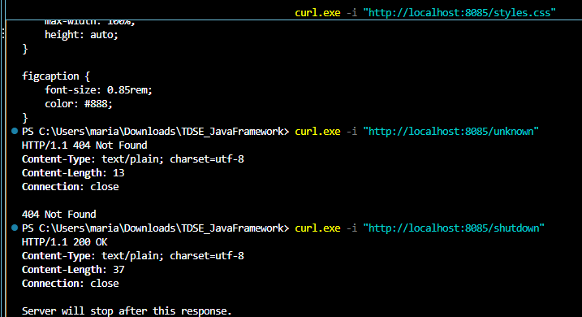
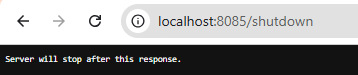
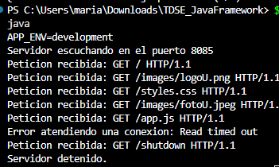

# Mini framework web en Java: servidor de aplicaciones con rutas lambda

Servidor HTTP secuencial escrito en Java, sin librerías externas, que evoluciona el servidor de la primera parte del laboratorio ([TDSE_HttpServer](https://github.com/marianamalagon11/TDSE_HttpServer)) hacia un pequeño framework web. El desarrollador registra servicios GET con funciones lambda, sin tocar el ciclo de conexión del servidor, y la configuración del despliegue sale de variables de entorno.

> Estado del README: completo hasta el apagado gradual (punto 7). Las secciones marcadas como **PENDIENTE** dependen de la aplicación de ejemplo final y del despliegue en la nube.

## Qué hace

- Sirve archivos estáticos (HTML, CSS, JavaScript e imágenes) desde `src/main/resources/webroot`.
- Registra servicios GET con lambdas: `get("/hello", (req, resp) -> ...)`.
- Extrae valores del query string con `req.getValue("name")`, incluyendo varios parámetros y parámetros ausentes.
- Resuelve cada petición en este orden: ruta dinámica, archivo estático, 404.
- No se cae ante peticiones inválidas: responde 400, 404 o 500 y sigue atendiendo.
- Lee el puerto y otros valores desde variables de entorno.
- Se apaga de forma gradual con una ruta `/shutdown` disponible solo en desarrollo.
- Es **secuencial**: atiende una conexión a la vez, sin hilos ni pools.

## Arquitectura

```
Application                      registra rutas y configuración
    |
WebFramework                     API pública: get(), staticfiles(), start(), stop()
    |
    +--> Router                  guarda la tabla ruta -> lambda
    |
HttpServer2                      acepta conexiones, interpreta la petición, envía la respuesta
    |
    +--> Request / Response      representan los datos HTTP que ve la lambda
    |
    +--> StaticFileService       entrega archivos cuando no hay ruta dinámica
```

Flujo de una petición:

```
Petición entrante
      |
Leer línea de petición y cabeceras
      |
¿Línea mal formada o método distinto de GET? --> 400
      |
Separar path y query string
      |
¿Hay una ruta dinámica registrada para el path?
   sí --> ejecutar la lambda --> 200 (o 500 si la lambda falla)
   no --> ¿existe el archivo estático?
             sí --> 200 con el tipo de contenido del archivo
             no --> 404 Not Found
```

## Responsabilidades de cada componente

| Componente | Archivo | Responsabilidad |
|---|---|---|
| Aplicación | `app/Application.java` | Lee la configuración, registra las rutas y arranca el servidor. Es lo único que cambia al añadir servicios. |
| API del framework | `WebFramework.java` | Ofrece `get()`, `staticfiles()`, `start()` y `stop()` para que el desarrollador no maneje sockets. Lee la variable `PORT`. |
| Router | `Router.java` | Asocia un path con la lambda que lo atiende. |
| Servidor HTTP | `HttpServer2.java` | Abre el `ServerSocket`, acepta conexiones una por una, interpreta la petición, decide entre ruta dinámica, estático o error, y escribe la respuesta. |
| Contrato del servicio | `WebService.java` | Interfaz funcional que cumple cada lambda: recibe `Request` y `Response` y devuelve el cuerpo. |
| Petición | `Request.java` | Expone el path y los parámetros del query string ya decodificados. |
| Respuesta | `Response.java` | Permite a la lambda ajustar el código de estado y el tipo de contenido. |
| Archivos estáticos | `StaticFileService.java` | Lee el recurso como bytes, deduce el tipo de contenido y rechaza rutas que intenten salir de la carpeta. |

## Metáfora: un edificio de oficinas

| Edificio | Framework |
|---|---|
| Entrada y recepcionista | **HttpServer2**: recibe a cada visitante, lee qué pide y atiende a uno a la vez. |
| Directorio del vestíbulo | **Router**: indica a qué oficina debe ir cada visitante. |
| Oficinas individuales | **Lambdas**: cada una presta un servicio concreto, como `/hello` o `/pi`. |
| Archivo de documentos | **StaticFileService**: entrega documentos ya guardados, como HTML, CSS, JavaScript e imágenes, cuando no hay una oficina para lo que se pidió. |
| Formulario del visitante | **Request**: lo que trae quien llega, su destino y sus datos. |
| Ventanilla de respuesta | **Response**: el estado y el tipo de documento que sale de la oficina. |
| Configuración del edificio | **Variables de entorno**: puerta de acceso (`PORT`), modo del edificio (`APP_ENV`) y saludo de bienvenida (`GREETING_PREFIX`). |
| Procedimiento de cierre | **Apagado gradual**: el edificio termina de atender al visitante actual, le entrega su respuesta y luego cierra la puerta. |
| Visitante sin destino | Sin oficina ni documento, recibe "404 Not Found". |

En producción la llave del cierre (`/shutdown`) no existe: nadie desde afuera puede cerrar el edificio.

## Uso del framework

```java
import static co.edu.escuelaing.httpserver.httpserver2.WebFramework.*;

public class Application {

    public static void main(String[] args) throws Exception {
        String greetingPrefix = System.getenv().getOrDefault("GREETING_PREFIX", "Hello");
        String appEnv = System.getenv().getOrDefault("APP_ENV", "development");

        staticfiles("/webroot");

        get("/hello", (req, resp) -> {
            String name = req.getValue("name");
            if (name == null || name.isBlank()) {
                name = "world";
            }
            return greetingPrefix + " " + name;
        });

        get("/pi", (req, resp) -> String.valueOf(Math.PI));

        if (appEnv.equals("development")) {
            get("/shutdown", (req, resp) -> {
                stop();
                return "Server will stop after this response.";
            });
        }

        start();
    }
}
```

El código completo está en [Application.java](src/main/java/co/edu/escuelaing/app/Application.java). Registrar una ruta nueva no requiere modificar el servidor.

## Estructura del proyecto

```
src/main/java/co/edu/escuelaing/
├── app/
│   └── Application.java
└── httpserver/httpserver2/
    ├── HttpServer2.java
    ├── WebFramework.java
    ├── Router.java
    ├── WebService.java
    ├── Request.java
    ├── Response.java
    └── StaticFileService.java

src/main/resources/webroot/
├── index.html
├── app.js
├── styles.css
└── images/
```

## Compilar y ejecutar en local

Requisitos: Java 21 y Maven 3.9 o superior.

Compilar y empaquetar:

```bash
mvn clean package
```

Ejecutar con Maven (PowerShell):

```powershell
$env:PORT="8085"; $env:APP_ENV="development"; $env:GREETING_PREFIX="Hola"; mvn -q compile exec:java
```

Ejecutar con Maven (bash):

```bash
PORT=8085 APP_ENV=development GREETING_PREFIX=Hola mvn -q compile exec:java
```

Ejecutar el JAR generado:

```bash
PORT=8085 java -jar target/httpServer2-1.0-SNAPSHOT.jar
```

Si no se define ninguna variable, el servidor usa el puerto 8080, el prefijo `Hello` y el ambiente `development`. Luego abre `http://localhost:8085`.

## Variables de entorno

| Variable | Propósito | Valor por defecto |
|---|---|---|
| `PORT` | Puerto en el que escucha el servidor. Si no es un número válido, el programa termina con un mensaje claro. | `8080` |
| `GREETING_PREFIX` | Texto con el que empieza la respuesta de `/hello`. | `Hello` |
| `APP_ENV` | Ambiente de ejecución. La ruta `/shutdown` solo se registra si vale `development`. | `development` |

El servidor escucha en todas las interfaces de red (`0.0.0.0`), no solo en `localhost`, para que la plataforma en la nube pueda alcanzarlo. La variable opcional `STATIC_FILES_PATH` del enunciado no se implementó. No hay credenciales ni claves en el repositorio.

## Ejemplos de URLs

Con el servidor local en el puerto 8085 y `GREETING_PREFIX=Hola`:

| Tipo | URL | Resultado |
|---|---|---|
| Servicio REST | `http://localhost:8085/hello?name=Mariana` | `Hola Mariana` |
| Servicio REST | `http://localhost:8085/hello?name=Pedro&language=en` | `Hola Pedro` |
| Servicio REST | `http://localhost:8085/hello` | `Hola world` |
| Servicio REST | `http://localhost:8085/pi` | `3.141592653589793` |
| Configuración | `http://localhost:8085/config` | Muestra `APP_ENV` y `GREETING_PREFIX` |
| Estático | `http://localhost:8085/index.html` | Página HTML |
| Estático | `http://localhost:8085/styles.css` | Hoja de estilos |
| Estático | `http://localhost:8085/app.js` | JavaScript |
| Estático | `http://localhost:8085/images/logoU.png` | Imagen PNG |
| Apagado (solo desarrollo) | `http://localhost:8085/shutdown` | Detiene el servidor |
| No existe | `http://localhost:8085/unknown` | 404 Not Found |

## Apagado gradual y secuencial

`stop()` no cierra nada por la fuerza: solo marca que el servidor ya no debe seguir corriendo. Al ser secuencial, el orden es siempre el mismo:

1. Llega la petición a `/shutdown` y se ejecuta su lambda, que llama a `stop()`.
2. El servidor envía la respuesta completa.
3. Cierra la conexión con ese cliente.
4. Comprueba la marca, sale del ciclo principal y cierra el `ServerSocket`.
5. Imprime "Servidor detenido." y el proceso termina.

La ruta solo se registra cuando `APP_ENV=development`. Con `APP_ENV=production` no existe y responde 404.

## Manejo de errores

| Situación | Respuesta |
|---|---|
| Ruta dinámica y archivo inexistentes | `404 Not Found` en texto plano |
| Línea de petición mal formada, versión que no empieza por `HTTP/` o path que no empieza por `/` | `400 Bad Request` |
| Método distinto de GET | `400 Bad Request` |
| Parámetro del query string mal codificado, por ejemplo `%zz` | `400 Bad Request` |
| Parámetro ausente | No falla: `getValue` devuelve `null` y la lambda decide |
| La lambda lanza una excepción | `500 Internal Server Error` |
| Intento de salir de la carpeta estática con `..` o pedir una carpeta | `404 Not Found` |
| Cliente que se conecta y no envía nada | La conexión se descarta a los 5 segundos |

Cualquier error dentro de una petición se registra en consola y el servidor sigue atendiendo la siguiente.

## Aplicación de ejemplo

**PENDIENTE (punto 8):** página con HTML, CSS, JavaScript e imágenes, y una llamada asíncrona con `fetch()` a los servicios REST. Aquí irá la descripción final y su captura.

## Despliegue en la nube

**PENDIENTE (punto 9).**

- Plataforma utilizada: por definir.
- URL pública: por definir.
- Pasos para reproducir el despliegue: por definir.
- Variables configuradas en la nube: `PORT` (la asigna la plataforma), `APP_ENV=production` y `GREETING_PREFIX`.

## Evidencias

### Local: servicios REST y variables de entorno

`/hello?name=Mariana` con `GREETING_PREFIX=Hola`, `/pi` y `/config` mostrando `APP_ENV` y `GREETING_PREFIX`:



### Local: recursos estáticos

Cabeceras de `/styles.css` (`text/css`) y de `/images/logoU.png` (`image/png`, 118284 bytes, igual al archivo original):



### Local: 404 y apagado

Respuesta 404 para `/unknown` y respuesta de `/shutdown` en desarrollo:



### Local: `/shutdown` detiene el servidor

Respuesta en el navegador y registro del servidor con "Servidor detenido.":





En el registro se ve también "Read timed out": es una conexión abierta por el navegador sin enviar nada, que el servidor descartó a los 5 segundos sin caerse.

### Pendientes de captura

- **PENDIENTE:** `/shutdown` devolviendo 404 con `APP_ENV=production` en local.
- **PENDIENTE:** salida de `mvn clean package` con `BUILD SUCCESS`.
- **PENDIENTE (nube):** página desplegada, un recurso estático, dos respuestas REST, las variables configuradas sin secretos y `/shutdown` con 404.

## Pruebas realizadas

Todas con el servidor corriendo y la herramienta `curl`.

| Prueba | Resultado esperado | Resultado |
|---|---|---|
| `GET /hello?name=Mariana` | 200, `Hola Mariana` | Correcto |
| `GET /hello?name=Pedro&language=en` | 200, usa `name` e ignora el resto | Correcto |
| `GET /hello` sin parámetro | 200, `Hola world` | Correcto |
| `GET /hello?name=` con valor vacío | 200, `Hola world` | Correcto |
| `GET /pi` | 200, `3.141592653589793` | Correcto |
| `GET /config` | 200, variables de entorno leídas | Correcto |
| `GET /` | 200, entrega `index.html` | Correcto |
| `GET /styles.css`, `/app.js` | 200 con `text/css` y `application/javascript` | Correcto |
| `GET /images/logoU.png`, `/images/fotoU.jpeg` | 200 con `image/png` e `image/jpeg`, bytes idénticos a los originales | Correcto |
| `GET /unknown` | 404 | Correcto |
| `GET /images/nada.png` | 404 | Correcto |
| `GET /images` (carpeta) | 404 | Correcto |
| `GET /../pom.xml` | 404, no sale de la carpeta estática | Correcto |
| `GET /hello?name=%zz` | 400, el servidor sigue vivo | Correcto |
| `POST /hello` | 400 | Correcto |
| Línea de petición mal formada (`HOLA MUNDO`, sin versión, versión inválida, path sin `/`) | 400 | Correcto |
| Conexión que no envía datos | Se descarta a los 5 s y se atiende la siguiente | Correcto |
| `GET /shutdown` con `APP_ENV=development` | 200 y el servidor se detiene | Correcto |
| `GET /shutdown` con `APP_ENV=production` | 404 y el servidor sigue vivo | Correcto |
| Sin variables de entorno | Puerto 8080, `Hello`, `development` | Correcto |
| `PORT=abc` | El programa termina con "PORT no es un numero valido" | Correcto |
| JAR ejecutado con `java -jar` | Sirve rutas, estáticos e imágenes | Correcto |

Aún no hay pruebas automatizadas con JUnit.

## Por qué esta arquitectura es mantenible

- **Separación de responsabilidades:** el servidor maneja sockets y HTTP; la aplicación solo define qué responde cada ruta.
- **Bajo acoplamiento:** añadir un servicio es una línea con `get()`. El ciclo de conexión no se toca.
- **Alta cohesión:** cada clase hace una sola cosa: enrutar, interpretar la petición, servir archivos o representar datos HTTP.
- **Abstracción:** el desarrollador usa `get()`, `staticfiles()` y `start()` sin ver sockets ni bytes.
- **Configuración externa:** el puerto, el ambiente y el saludo cambian sin recompilar, y el mismo artefacto corre en local y en la nube.
- **Seguridad por ambiente:** la ruta de apagado solo existe en desarrollo.
- **Extensibilidad:** la interfaz `WebService` permite registrar cualquier comportamiento como función.
- **Robustez:** los errores de una petición no afectan a las demás.

## Alcance y limitaciones

El servidor es intencionalmente secuencial: atiende una conexión a la vez, sin hilos, pools ni ejecución asíncrona en el servidor. Solo soporta el método GET.
